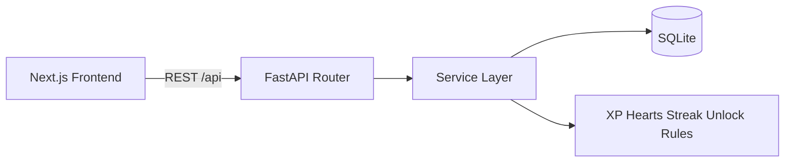

# Duolingo Clone (Assignment Submission)

A full-stack Duolingo-style learning app built with:

- `frontend/`: Next.js 16 App Router + TypeScript + Tailwind v4
- `backend/`: FastAPI + SQLAlchemy + Alembic + SQLite

The implementation focuses on the assignment's core vertical slice: learning path, lesson player,
XP/hearts/streak rules, profile, leaderboard, and supporting pages with Duolingo-like styling.

## Stack and architecture

### Frontend

- Next.js App Router (`frontend/src/app`)
- Shared UI primitives under `frontend/src/components/ui`
- Layout shell under `frontend/src/components/layout`
- Learn path and lesson experience under:
  - `frontend/src/components/learn`
  - `frontend/src/components/lesson`
- API client and contracts under `frontend/src/lib/api`

### Backend

- FastAPI app entry: `backend/app/main.py`
- API routing: `backend/app/api/routes`
- Business logic: `backend/app/services`
- Models: `backend/app/models`
- Schemas: `backend/app/schemas`
- Migrations: `backend/alembic`

### Data flow (high level)

1. Frontend calls FastAPI (`/api/*`) via `frontend/src/lib/api/client.ts`.
2. FastAPI loads the seeded user through a centralized dependency.
3. Services apply game rules (hearts, streaks, XP, unlocks, idempotent completion).
4. SQLite persists content and progress.

### Architecture diagram



## Repository layout

```text
.
├── backend/
│   ├── alembic/
│   ├── app/
│   │   ├── api/
│   │   ├── models/
│   │   ├── schemas/
│   │   └── services/
│   └── tests/
├── frontend/
│   ├── e2e/
│   └── src/
│       ├── app/
│       ├── components/
│       └── lib/
├── .env.example
└── package.json
```

## Prerequisites

- Node.js 22+
- npm
- Python 3.12+

## Local setup

1) Copy environment values:

```bash
cp .env.example .env
```

2) Install frontend deps:

```bash
cd frontend
npm install
```

3) Install backend deps:

```bash
cd backend
python3 -m venv .venv
source .venv/bin/activate
pip install -r requirements.txt
```

4) Run migrations and seed data from repo root:

```bash
npm run migrate:backend
npm run seed:backend
```

## Run in development

Run each service in separate terminals from repo root:

```bash
npm run dev:backend
npm run dev:frontend
```

- Frontend: http://localhost:3000
- API docs: http://localhost:8000/api/docs
- API health: http://localhost:8000/api/health

## Environment variables

Defined in `.env.example`:

- `NEXT_PUBLIC_API_URL`: frontend API base URL
- `DATABASE_URL`: SQLAlchemy DB URL
- `BACKEND_CORS_ORIGINS`: allowed frontend origins
- `DEFAULT_USERNAME`: mocked logged-in username
- `DEFAULT_COURSE_SLUG`: path course slug
- `HEART_REGEN_MINUTES`: lazy heart regeneration interval

## Database schema (ER overview)

Core content hierarchy:

```text
Course -> Unit -> Skill -> Lesson -> Exercise
```

Progress and attempts:

```text
User -> UserSkillProgress
User -> UserLessonProgress
User -> LessonAttempt -> Lesson
```

Important constraints/rules:

- Ordered uniqueness (for example: unit position inside a course, lesson position inside a skill)
- Per-user uniqueness for skill progress and lesson progress
- Check constraints for XP/hearts/progress bounds
- Cascading deletes from content to child entities/progress

## Seeded content and account

The seed is idempotent and creates:

- 1 course (`spanish-for-english`)
- 4 units, 8 skills, 16 lessons, 80 exercises
- 5 exercise types distributed across lessons
- 6 users total (default learner + leaderboard users)
- mixed progress states (completed/available/locked) for immediate UI coverage

Default learner baseline:

- username: `learner`
- hearts: `4/5`
- gems: `500`
- total XP: `40`
- current streak: `7`
- daily goal: `20` (already reached in seed state)

## API overview

All endpoints are prefixed with `/api`.

- `GET /me` — current learner + top stats
- `GET /me/profile` — profile stats (longest streak, completions, attempts)
- `GET /path` — ordered units/skills/lessons + statuses
- `POST /lessons/{lesson_id}/start` — start or resume active attempt
- `POST /attempts/{attempt_id}/answer` — validate answer in strict lesson order
- `POST /attempts/{attempt_id}/complete` — finalize attempt; award XP/unlock/streak updates (idempotent)
- `GET /leaderboard` — weekly XP ranking
- `POST /hearts/refill` — mock practice refill (costs gems)

Security/data note:

- Lesson start payloads exclude canonical answers.
- Validation happens server-side at answer submission.

### Endpoint verification snapshot

Verified against backend route definitions (`backend/app/api/routes`) and app-level health route
(`backend/app/main.py`):

- `GET /api/me`
- `GET /api/me/profile`
- `GET /api/path`
- `POST /api/lessons/{lesson_id}/start`
- `POST /api/attempts/{attempt_id}/answer`
- `POST /api/attempts/{attempt_id}/complete`
- `GET /api/leaderboard`
- `POST /api/hearts/refill`
- `GET /api/health`

## Lesson exercise payload contract

`exercise.payload` is typed by `exercise_type`.

- `multiple_choice`: `options`, `answer`
- `word_bank`: `tokens`, `answer[]`
- `match_pairs`: `pairs[]`
- `fill_blank`: `sentence`, `options`, `answer`
- `type_answer`: `accepted_answers[]`, `case_sensitive`

## Test commands

From repo root:

```bash
npm run test:backend
npm run lint:frontend
npm run test:frontend
npm run build:frontend
```

Optional E2E (requires app running and Playwright browsers installed):

```bash
npm run test:e2e:frontend
```

## Assumptions and trade-offs

- Authentication is mocked to one seeded user for MVP speed.
- Gems economy is intentionally simplified (spend-only in current scope).
- Social/subscription/multi-language are placeholders.
- SQLite is used for assignment simplicity and portability.

## Deployment guide (Step 10)

### Frontend (Vercel)

1. Import repository in Vercel.
2. Set root directory to `frontend`.
3. Set env:
   - `NEXT_PUBLIC_API_URL=<public-backend-url>/api`
4. Deploy.

### Backend (Railway)

1. Deploy `backend` as a Python web service.
2. Set root directory to `backend`.
3. Start command:
   - `uvicorn app.main:app --host 0.0.0.0 --port $PORT`
4. Add persistent volume and mount it at `/data`.
5. Set `DATABASE_URL=sqlite:////data/duolingo.db`.
6. Configure remaining env vars from `.env.example`.
7. In Railway Console, run migrations and seed once:
   - `alembic upgrade head`
   - `python -m app.seed`

### Production checklist

- Configure CORS to include frontend domain
- Verify `/api/health` and `/api/docs`
- Verify Learn -> Lesson -> Complete flow
- Verify profile and leaderboard load
- Verify heart refill and gem deduction

## Manual verification log

Step 10 manual checks were completed against the current repository state:

- Setup steps in this README align with executable root scripts.
- API endpoint list matches backend route modules and app-level health route.
- Seed counts match `backend/app/seed.py` constants (`4/8/16/80`).
- Deploy section includes frontend API env, backend env/CORS, and SQLite persistence guidance.

## Submission URLs

- Repository URL: `https://github.com/yashgoel1331/Clone-Duolingo`
- Live frontend URL: `https://frontend-six-alpha-86.vercel.app`
- Live backend URL: `https://clone-duolingo-backend-production.up.railway.app`
